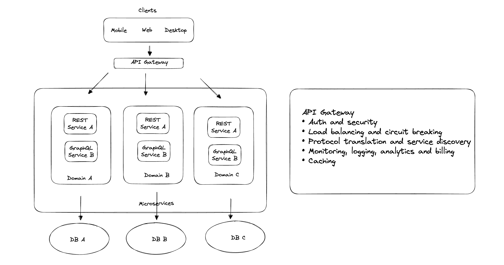
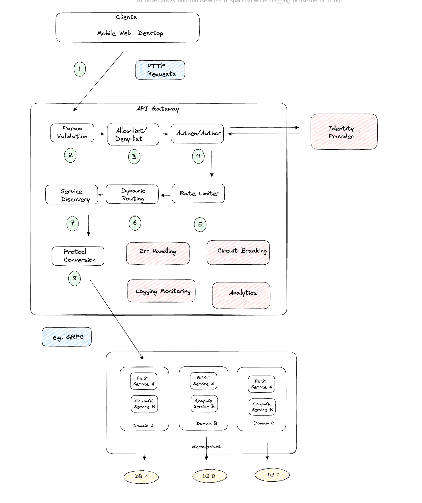
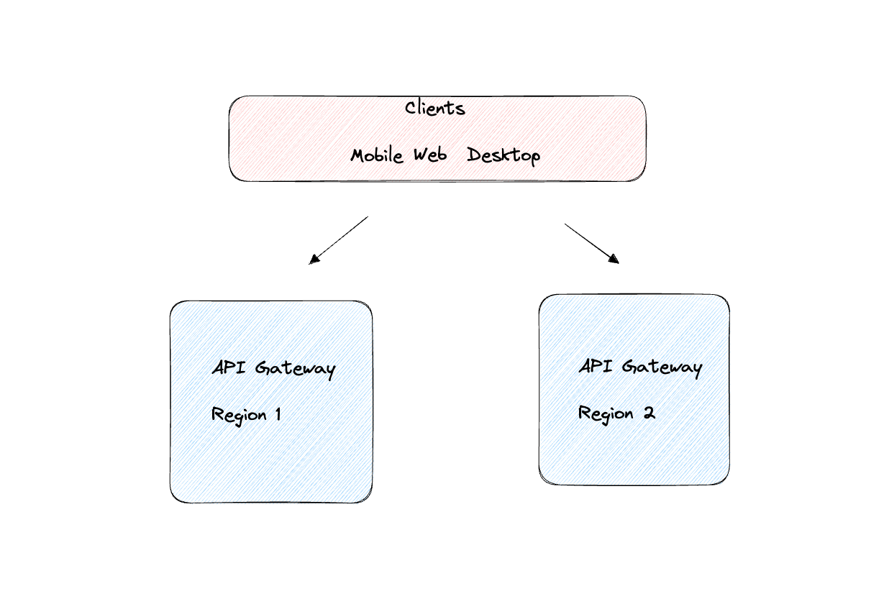
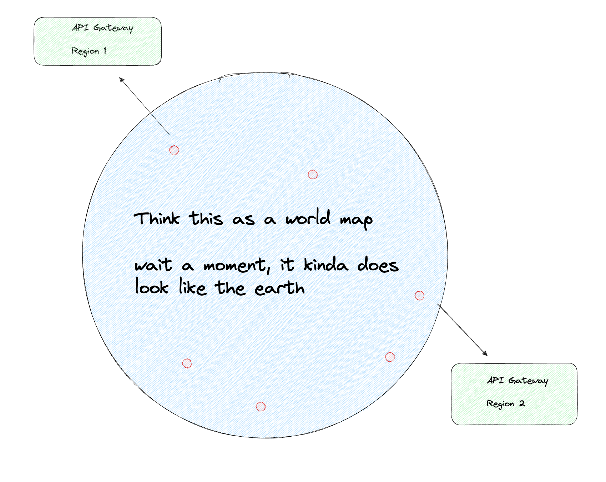

Simply put, it is a sinlge point of entry to the clients of an application.

### Structure

### Flow

### Region

### Deployment

I was gonna draw a world map to show you what's going on, but ended up not doing it because I didn't know how. So, basically the API gataways should be deployed across the world close to the clients, most cloud providers offer that.